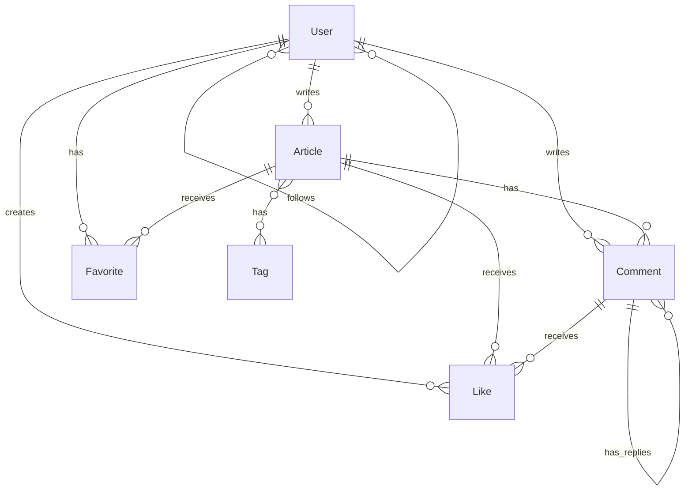

# 資料模型設計文檔

## 模型關聯圖

## 1. 核心模型

### 1.1 User 模型
- 用戶基本資料與狀態
- 關聯：
  - 一個用戶可以有多篇文章 (hasMany Article)
  - 一個用戶可以有多個評論 (hasMany Comment)
  - 一個用戶可以有多個收藏 (hasMany Favorite)
  - 一個用戶可以有多個點讚 (hasMany Like)
  - 用戶之間可以互相關注 (belongsToMany User)
- 屬性：
  - is_admin: 管理員標記
  - is_active: 帳號狀態
  - last_login_at: 最後登入時間

### 1.2 Article 模型
- 文章內容與統計
- 關聯：
  - 屬於一個用戶 (belongsTo User)
  - 有多個評論 (hasMany Comment)
  - 有多個標籤 (belongsToMany Tag)
  - 有多個收藏 (hasMany Favorite)
  - 有多個點讚 (morphMany Like)
- 屬性：
  - is_draft: 草稿狀態
  - published_at: 發布時間
  - views_count: 瀏覽次數
  - likes_count: 點讚次數
  - comments_count: 評論次數

### 1.3 Comment 模型
- 評論內容與狀態
- 關聯：
  - 屬於一篇文章 (belongsTo Article)
  - 屬於一個用戶 (belongsTo User)
  - 可以有子評論 (hasMany Comment)
  - 有多個點讚 (morphMany Like)
- 屬性：
  - parent_id: 父評論ID
  - is_approved: 審核狀態
  - likes_count: 點讚次數

## 2. 輔助模型

### 2.1 Tag 模型
- 文章標籤
- 關聯：
  - 屬於多篇文章 (belongsToMany Article)
- 特性：
  - 標籤名稱唯一

### 2.2 Favorite 模型
- 文章收藏記錄
- 關聯：
  - 屬於一個用戶 (belongsTo User)
  - 屬於一篇文章 (belongsTo Article)

### 2.3 Like 模型
- 點讚記錄（多態）
- 關聯：
  - 屬於一個用戶 (belongsTo User)
  - 可以屬於文章或評論 (morphTo likeable) 