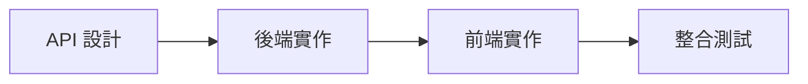

# 開發流程指南

## 1. 功能開發流程

### 1.1 API 設計階段
- 定義 API 端點與規格
  - 使用 RESTful 設計原則
  - 定義資源 URI
  - 規劃 HTTP 方法使用
- 設計資料結構
  - 定義資料表關聯
  - 設計資料模型
- 撰寫 API 文檔
  - 使用 OpenAPI/Swagger
  - 包含請求/響應範例
  - 錯誤處理說明

### 1.2 後端實作階段
- 資料庫設計與實作
  - 建立 Migration
  - 設定 Model 關聯
  - 建立 Factory 與 Seeder
- API 實作
  - 建立 Controller
  - 實作 Service 層邏輯
  - 建立 API Resource
- 測試
  - 單元測試
  - 功能測試
  - API 測試

### 1.3 前端實作階段
- 元件開發
  - 建立頁面組件
  - 實作共用組件
  - 處理表單驗證
- API 整合
  - 實作 API 服務
  - 錯誤處理機制
  - Loading 狀態管理
- 狀態管理
  - 設計 Store 結構
  - 實作 Actions/Mutations
  - 優化狀態更新

### 1.4 整合測試階段
- 功能測試
  - 完整流程測試
  - 錯誤處理測試
  - 邊界條件測試
- 使用者體驗
  - 載入效能
  - 錯誤提示
  - 操作流暢度
- 最終檢查
  - API 規格符合度
  - 程式碼品質
  - 文檔完整性

## 2. 開發準則

### 2.1 API 開發規範
- API 文檔必須先於實作
- 使用 OpenAPI/Swagger 格式
- 包含請求/響應範例

### 2.2 前端開發規範
- 組件化開發
- 使用組合式 API
- 合理的狀態管理 