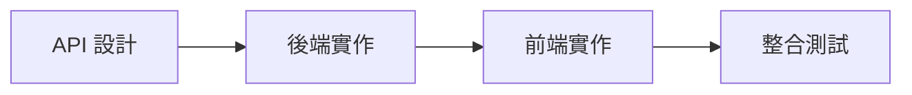

# 開發流程指南

## 1. 功能開發流程

每個功能必須按照以下順序開發：

### 1.1 API 設計
- 定義 API 端點
- 設計請求/響應格式
- 撰寫 API 文檔

### 1.2 後端實作
- 建立資料表結構
- 實作 API 邏輯
- 編寫單元測試
- API 測試（使用 Postman）

### 1.3 前端實作
- 頁面/組件開發
- 串接 API
- 處理錯誤情況
- UI/UX 優化

### 1.4 整合測試
- 功能完整性測試
- 錯誤處理測試
- 使用者體驗確認

## 2. 開發準則

### 2.1 API 開發規範
- API 文檔必須先於實作
- 使用 OpenAPI/Swagger 格式
- 包含請求/響應範例

### 2.2 前端開發規範
- 組件化開發
- 使用組合式 API
- 合理的狀態管理 